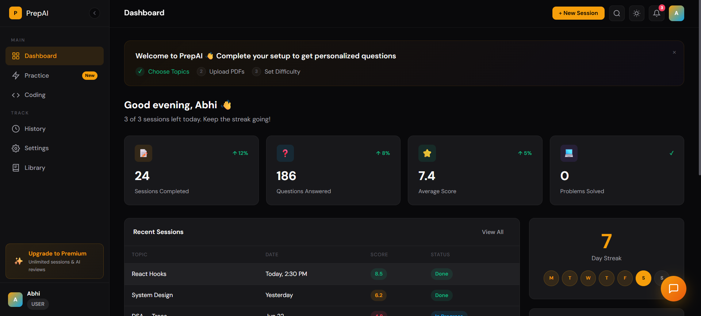

# PrepAI

**AI-powered interview preparation platform** that generates adaptive questions, provides real-time feedback, and tracks your progress across sessions.



---

## Overview

PrepAI is a full-stack web application designed to help software engineers prepare for technical interviews. Unlike generic question banks, PrepAI uses AI to generate questions tailored to your specific role, tech stack, and experience level — then scores your answers and maps your weaknesses over time.

The platform covers behavioral, system design, coding, and domain-specific topics (React, Node.js, TypeScript, NestJS, DSA, and more). It includes a built-in code editor, PDF document viewer, performance analytics dashboard, and an AI chat assistant.

---

## Table of Contents

- [Screens](#screens)
- [Features In Detail](#features-in-detail)
- [Tech Stack](#tech-stack)
- [Project Structure](#project-structure)
- [Backend API](#backend-api)
- [Getting Started](#getting-started)
- [Testing](#testing)
- [UI Prototype](#ui-prototype)

---

## Screens

The application has the following screens, each accessible via the sidebar navigation:

| Screen | Description |
|--------|-------------|
| Landing | Public marketing page with hero, features, testimonials, CTA |
| Auth | Login/signup with email and social providers |
| Dashboard | KPIs, recent sessions, streak, score chart, weak areas |
| Practice | Topic + difficulty selection, timed questions, AI feedback |
| Question Bank | Browsable/filterable/searchable grid of all questions |
| Coding | DSA problems with Monaco editor, test cases, AI verdict |
| History | Past sessions with expandable Q&A and feedback |
| Settings | Profile, notifications, preferences, AI config, documents |
| Library | PDF viewer with zoom, navigation, fullscreen, bulk delete |
| Chatbot | Floating AI assistant with topic-aware responses |

---

## Features In Detail

### 1. Landing Page

The public-facing marketing page shown to unauthenticated visitors.

- **Navigation bar** with brand logo, feature links (Features, How It Works, Results), theme toggle, login, and "Start Free" CTA
- **Hero section** with animated terminal mockup that simulates a live PrepAI session — shows command input, question display, answer submission, and score output with typing animation
- **Feature grid** (3 cards): Adaptive AI Engine, Line-by-Line Feedback, Weakness Mapping — each with icon, description, and hover effects
- **Testimonials section** (3 cards): Quotes from engineers at Google, Stripe, and Vercel with star ratings, avatars, names, and roles
- **How It Works** (4 steps): Pick Your Stack → Answer Live → Get AI Feedback → Track Growth — connected by a gradient line with numbered dots
- **Big number stats** (4 cards): 500+ Practice Questions, 20+ Topic Categories, 12k+ Sessions Completed, Free / No Credit Card
- **CTA section**: "Stop preparing the hard way" with gradient border and primary button
- **Footer** with copyright, privacy, terms, Twitter, GitHub links
- **Scroll reveal animations** on all sections via IntersectionObserver
- **Hero counter animation** that counts up to target numbers with easing

### 2. Authentication

Login and registration screen with social and email options.

- **Login mode**: Email + password fields, "Sign In" button, "Create one" link to switch to signup
- **Signup mode**: Full name field appears, "Create Account" button, "Sign in" link to switch back
- **Social login**: Google and GitHub buttons with SVG icons
- **Divider**: "OR" separator between social and email forms
- **Form validation**: Required fields, email format
- **Background glow**: Radial gradient behind the auth card
- **Smooth transition** between login and signup modes

### 3. Dashboard

The main hub after login showing progress overview and quick actions.

- **Welcome banner** (new users only): 3-step setup checklist (Choose Topics ✓, Upload PDFs, Set Difficulty) with dismiss button
- **Greeting**: "Good evening, Abhi" with session count for the week
- **KPI row** (4 cards):
  - Sessions Completed (24, +12% trend)
  - Questions Answered (186, +8% trend)
  - Average Score (7.4, +5% trend)
  - Topics Covered (8, -2% trend)
- **Recent sessions table**: Topic, Date, Score (color-coded pill), Status — with "View All" link to History
- **Suggested practice**: Clickable tag chips for weak areas (DSA — Graphs, System Design, React Performance, Node.js Streams, Coding — Two Sum)
- **Streak tracker**: 7-day streak with day indicators (M T W T F S S), completed days highlighted in amber, current day solid amber
- **Score trend chart**: SVG line chart showing last 7 session scores with gradient fill, grid lines, date labels, and dot markers
- **Weak areas**: Progress bars for DSA (45%), System Design (62%), Node.js (71%), NestJS (78%) — each with color-coded gradient fills

### 4. Practice Sessions

The core interview practice flow with timed questions and AI scoring.

- **Topic selector**: Pill buttons for React, NestJS, TypeScript, System Design, DSA, Node.js — single select
- **Difficulty selector**: Junior, Mid, Senior — single select
- **Start card**: Shows selected topic, difficulty, and question count with "Start Session" button
- **Question card** (active session):
  - Question counter ("Q1 of 8")
  - Timer (MM:SS format, counts up from 00:00)
  - Progress bar showing completion percentage
  - Question text
  - Textarea for answer input
  - Skip and Submit buttons
- **AI feedback card** (after submission):
  - Animated score ring (SVG circle with gradient stroke, animates from 0 to score)
  - Score display (e.g., "8.5 / 10")
  - Verdict text ("Excellent Answer!", "Good Answer!", "Decent Answer!")
  - Detailed feedback paragraph
  - Action buttons: Next Question, Practice Same Topic Again, End Session
- **Loading overlay**: Animated spinner with "AI is analyzing your answer..." text during scoring

### 5. Question Bank

Browse and search the full question library.

- **Search box**: Real-time search filtering across all questions
- **Topic filter**: All, React, NestJS, TypeScript, System Design, DSA, Node.js
- **Difficulty filter**: All, Junior, Mid, Senior
- **Question grid**: Card layout showing:
  - Topic tag (color-coded pill)
  - Difficulty pill
  - Question text (3-line clamp)
  - Estimated time (~5 min)
  - "Practice →" button linking to Practice screen with that topic pre-selected
- **Pagination**: Page buttons with prev/next arrows, current page highlighted
- **Empty state**: "No questions found" with clear filters button

### 6. Coding Challenges

DSA and algorithm problems with a built-in code editor.

- **Problem list view**:
  - Topic filter pills: All, Arrays, Strings, Trees, Graphs, DP, Two Pointers
  - Card grid with difficulty indicator (left border color: green=Easy, amber=Medium, red=Hard)
  - Each card shows: problem number, difficulty pill, title, description preview, topic tag, estimated time
  - Click to open problem detail
- **Problem detail + editor view** (split panel):
  - **Left panel** (collapsible): Problem title, difficulty + topic pills, full description, example inputs/outputs/explanations, constraints list
  - **Right panel**:
    - Editor header: Filename tab (auto-generated from problem title + language extension), Run button, Submit button, language dropdown (JavaScript, TypeScript, Python), reset button, fullscreen button
    - Monaco editor: Syntax highlighting, line numbers, JetBrains Mono font, dark theme, 480px height
    - Output panel: Tab bar (Output, Test Cases), clear button
      - Output tab: Shows "Click Run Code to see output" placeholder
      - Test Cases tab: Input/Expected pairs for each example
- **Run code results**: Accepted/rejected verdict, per-test-case pass/fail with input/expected/got, runtime, memory, pass count
- **Submit results** (modal overlay): Verdict pill (Accepted/Wrong Answer), time complexity analysis, space complexity analysis, AI suggestion paragraph, "Next Problem" and "Close" buttons
- **Fullscreen editor**: Overlay with header (filename, language, reset, minimize), full-viewport Monaco editor
- **Language switching**: Updates editor content, filename extension, and Monaco language mode
- **Code reset**: Restores boilerplate template for current problem and language

### 7. Session History

Review all past practice sessions with detailed Q&A breakdown.

- **Export CSV button**: Downloads session data
- **History table**: Date, Type (Practice pill), Topic, Questions count, Avg Score (color-coded), Duration, Status (Completed/In Progress)
- **Expandable rows**: Click any row to expand and see:
  - Q&A blocks for each question in that session
  - Each block shows: Question, User's Answer, AI Feedback (highlighted in amber)
- **Empty state**: "No sessions yet" with "Start Practicing" button

### 8. Settings

Comprehensive user preferences organized into tabs.

- **Tab navigation**: Profile, Notifications, Practice Preferences, AI & Sources, Documents, Danger Zone

#### Profile
- First Name, Last Name (side by side)
- Email
- Target Role dropdown: Frontend Engineer, Full-Stack Engineer, Backend Engineer, DevOps Engineer, Engineering Manager
- Experience Level dropdown: Junior (0-2 yrs), Mid (2-5 yrs), Senior (5+ yrs)
- Target Companies: Comma-separated text input
- Save Changes button

#### Notifications
- Toggle switches for:
  - Daily Practice Reminder (7 PM)
  - Weekly Progress Report (Sunday)
  - New Questions Alert
  - Streak Milestone Alerts (7, 14, 30 days)
  - Email Digest (weekly summary)
- Save Preferences button

#### Practice Preferences
- Default Difficulty dropdown: Junior, Mid, Senior, Mixed (random)
- Session Length dropdown: 5, 10, 15, 20 questions
- Timer per Question dropdown: No timer, 2 min, 5 min, 10 min
- Preferred Topics: Clickable tag chips (React, TypeScript, System Design, DSA, NestJS, Node.js)
- Toggle: Show hints after skip
- Toggle: Auto-advance to next question (3-second delay)
- Save Preferences button

#### AI & Sources
- **AI Model card**: Provider (NVIDIA NIM), Model (meta/llama-1.8b-instruct), Connection status (green dot + "Connected"), Test Connection button
- **PDF Sources list**: Each PDF card shows name, size, page count, enable/disable toggle, delete button
- **Web Search toggle**: Also search web for latest questions from official docs

#### Documents
- PDF upload area with drag-and-drop support
- File list with toggle and delete for each uploaded PDF
- Drag-over visual feedback (border color change, background highlight)

#### Danger Zone
- **Reset All Progress**: Red-bordered card with description and "Reset Progress" button
- **Delete Account**: Red-bordered card with description and "Delete Account" button
- **Export All Data**: Red-bordered card with description and "Export Data" button

### 9. Library

PDF document viewer for reading uploaded study materials.

- **List view**:
  - Toolbar with "My PDFs" title, select count badge, Select/Cancel button, Delete button
  - Card grid: Each card shows PDF icon, filename, file size, page count, "PDF Document" tag, "Open →" link
  - Select mode: Checkboxes appear on cards, multi-select for bulk delete
- **Viewer view**:
  - Back button to return to list
  - Header: PDF filename with document icon, zoom controls (zoom out, percentage, zoom in, reset to 100%), fullscreen button
  - Body: PDF iframe or placeholder if not available
  - Toolbar: Previous page, page counter ("Page 1 / 142"), next page
- **Fullscreen view**: Full-viewport PDF viewer with same controls
- **Delete confirmation**: Modal dialog with "Delete PDFs" title, file count message, Cancel and Delete buttons

### 10. Chatbot

AI assistant accessible from any screen via floating bubble.

- **Chat bubble**: Fixed bottom-right, amber gradient background, message icon, hover scale effect, rotation animation when open
- **Chat popup** (380x520px):
  - Header: Green pulsing dot, "PrepAI Assistant" title, fullscreen button, close button
  - Messages area: Scrollable, user messages (amber, right-aligned), bot messages (surface background, left-aligned)
  - Input area: Text input with placeholder, send button (amber)
- **Topic-aware responses**: Detects keywords (React, JavaScript, DSA, System Design, TypeScript, help, thank) and returns relevant advice
- **Fullscreen mode**: Expands to fill most of the viewport (900px max-width)

### 11. Global Features

Cross-cutting functionality available on all screens.

- **Dark/Light theme**: Toggle via navbar or toolbar icon, persisted to localStorage, full CSS variable system for both modes
- **Global search**: Inline search in toolbar, real-time filtering across pages (Practice, Coding, History, Settings, Question Bank), keyboard navigation (arrow keys, Enter, Escape)
- **Notifications dropdown**: Bell icon with unread count badge, notification items with colored icons (green/amber/red/blue), "Mark all read" action, items show session completions, new topics, streak milestones, weekly reports
- **Toast notifications**: Bottom-right stack, success (green checkmark), error (red X), info (blue ℹ), auto-dismiss after 3.5 seconds, manual close, slide-in animation
- **Responsive design**: Mobile sidebar as overlay with hamburger menu, stacked grid layouts, adjusted padding/typography
- **Collapsible sidebar**: Toggle between expanded (240px) and collapsed (60px) modes, icons-only when collapsed, tooltip on hover
- **User menu**: Avatar with dropdown (Settings, Log out) in both sidebar footer and toolbar

---

## Tech Stack

| Layer | Technology | Version |
|-------|-----------|---------|
| Bundler | Vite + esbuild | 8.1.0 |
| Language | TypeScript (strict mode) | 6.0.3 |
| UI Library | React | 19.2.7 |
| Routing | React Router | 8.0.1 |
| State Management | Redux Toolkit + React Redux | 2.12.0 / 9.3.0 |
| Server State | TanStack Query | 5.101.2 |
| Component Library | Shadcn UI (base-nova style) | 4.12.0 |
| Styling | Tailwind CSS | 4.3.1 |
| HTTP Client | ky | 2.0.2 |
| Validation | Zod | 4.4.3 |
| Forms | React Hook Form + @hookform/resolvers | 7.80.0 / 5.4.0 |
| Auth | Clerk (@clerk/clerk-react) | 5.61.3 |
| Unit Testing | Vitest + @testing-library/react + jsdom | 4.1.9 |
| E2E Testing | Playwright | 1.52.0 |
| Fonts | DM Sans + JetBrains Mono (Fontsource) | 5.2.8 |
| Package Manager | pnpm | 11.5.0 |

---

## Project Structure

```
PrepAI/
├── public/
│   └── dashboard.png              # Dashboard screenshot for README
├── e2e/
│   ├── frontend/
│   │   └── smoke.spec.ts          # Frontend E2E tests
│   └── backend/
│       └── smoke.spec.ts          # Backend E2E tests
├── server/                         # Backend (NestJS + Fastify)
│   └── README.md                   # Backend documentation and API Spec
├── ui/                             # Frontend (React + Vite)
│   ├── public/                     # Static assets (favicon, icons)
│   ├── src/
│   │   ├── assets/                 # Images (react.svg, vite.svg, hero.png)
│   │   ├── components/ui/          # Shadcn UI components
│   │   ├── lib/
│   │   │   └── utils.ts            # cn() utility (clsx + tailwind-merge)
│   │   ├── store/
│   │   │   └── index.ts            # Redux store configuration
│   │   ├── test/
│   │   │   └── setup.ts            # Vitest setup (@testing-library/jest-dom)
│   │   ├── App.tsx                 # Root component
│   │   ├── App.css                 # Component styles
│   │   ├── index.css               # Global styles + Tailwind import
│   │   └── main.tsx                # Entry point with providers
│   ├── .env.example                # Environment variable template
│   ├── components.json             # Shadcn UI configuration
│   ├── eslint.config.js            # ESLint configuration
│   ├── index.html                  # HTML entry point
│   ├── package.json                # Frontend dependencies
│   ├── pnpm-lock.yaml              # Lockfile
│   ├── tsconfig.json               # Root TypeScript config
│   ├── tsconfig.app.json           # App TypeScript config (strict mode)
│   ├── tsconfig.node.json          # Node TypeScript config
│   └── vite.config.ts              # Vite config (aliases, Tailwind, Vitest)
├── package.json                    # Root package (Playwright E2E tests)
├── playwright.config.ts            # Playwright config (frontend + backend)
├── prepai-ui.html                  # Full standalone UI prototype
├── GEMINI.md
└── README.md
```

---

## Backend API

The backend is built with NestJS and Fastify, integrating Mastra LLM agents for technical interview feedback. 

For the complete list of endpoints, payloads, and mock requests/responses, see the [README.md](file:///c:/antigravity-test/PrepAI/server/README.md) specification in the `server` directory.

---

## Getting Started

### Prerequisites

- Node.js 18+
- pnpm 9+

### 1. Clone the repository

```bash
git clone <repo-url>
cd PrepAI
```

### 2. Install frontend dependencies

```bash
cd ui
pnpm install
```

### 3. Set up environment variables

Create `ui/.env` from the template:

```bash
cp ui/.env.example ui/.env
```

Edit `ui/.env` and add your Clerk publishable key:

```
VITE_CLERK_PUBLISHABLE_KEY=pk_test_your_key_here
VITE_API_BASE_URL=http://localhost:3000
```

### 4. Start the frontend dev server

```bash
cd ui
pnpm dev
```

The app will be available at `http://localhost:5173`.

### 5. Install E2E test dependencies (optional)

```bash
pnpm install          # at root level
npx playwright install chromium
```

---

## Testing

### Unit Tests (Vitest)

```bash
cd ui
pnpm test            # run all tests
pnpm test:ui         # open Vitest UI
```

### E2E Tests (Playwright)

```bash
pnpm test                          # run all E2E tests
pnpm test:frontend                 # frontend tests only
pnpm test:backend                  # backend tests only
pnpm test:chromium                 # chromium project only
pnpm report                        # open HTML report
```

---

## UI Prototype

The file `prepai-ui.html` at the project root is a **fully self-contained HTML prototype** of the entire application. It includes:

- All screens (Landing, Auth, Dashboard, Practice, Question Bank, Coding, History, Settings, Library)
- Working navigation between screens
- Dark/light theme toggle
- Interactive elements (filters, search, chatbot, toasts)
- 10 coding problems with Monaco editor integration
- 30+ practice questions across 6 topics
- Session history with expandable Q&A
- PDF viewer with zoom and navigation
- Responsive design

Open it in any browser — no backend, no dependencies, no build step required.

---

## License

Private project. All rights reserved.
